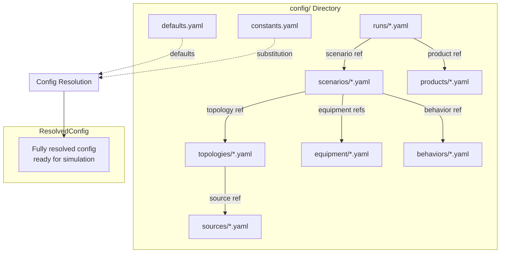
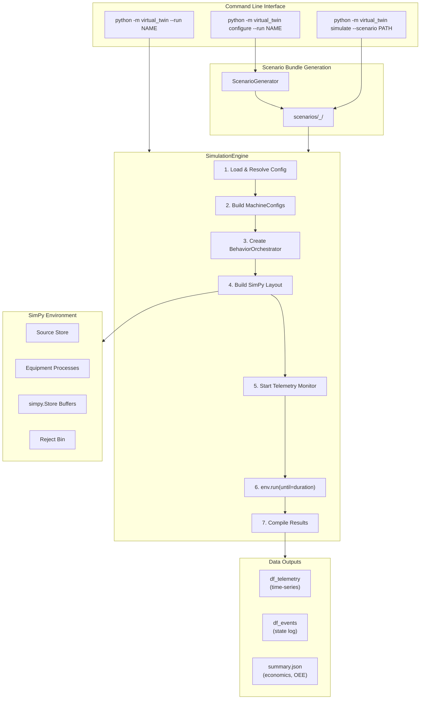
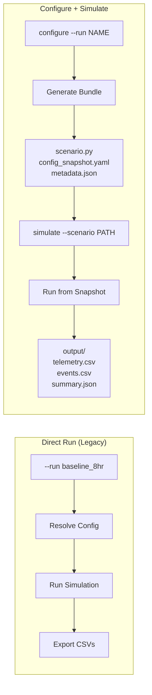
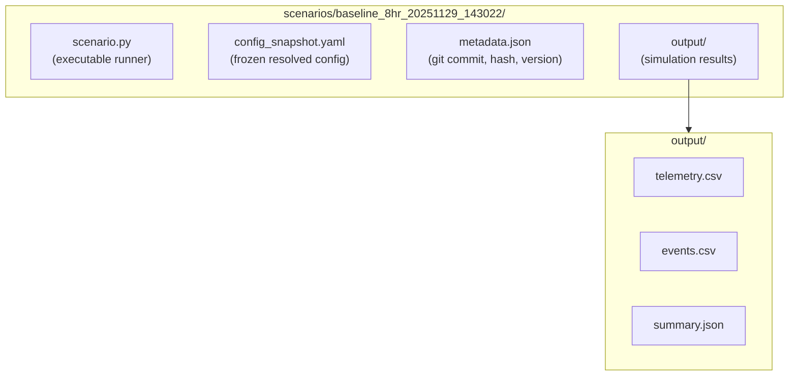
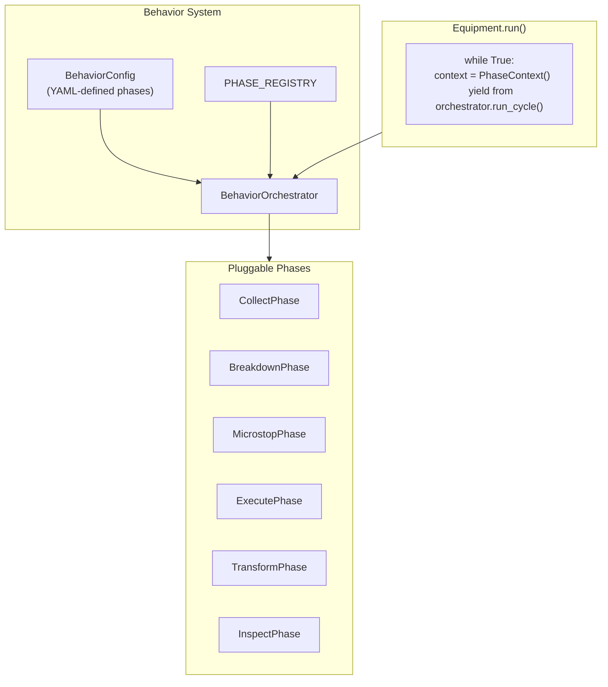
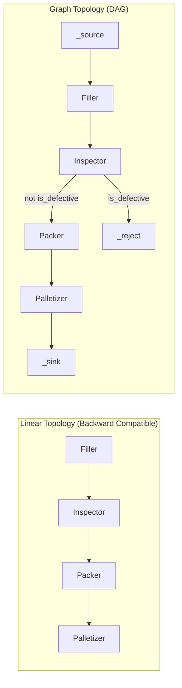
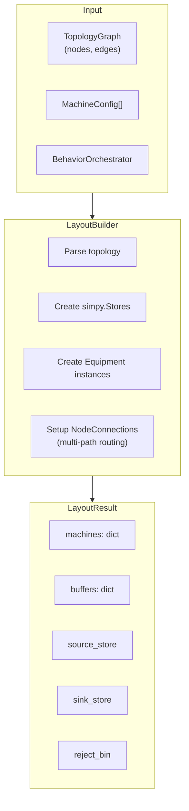
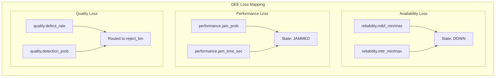
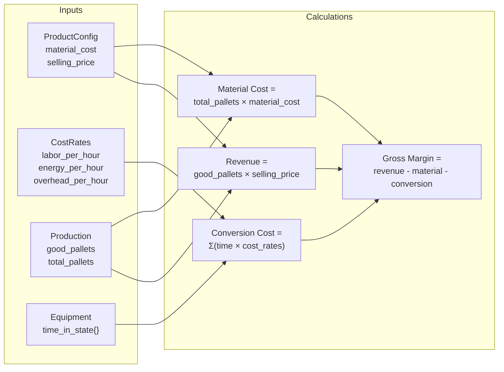

# Digital Twin Architecture

## Module Structure

```
src/virtual_twin/
├── __init__.py          # Public API exports
├── __main__.py          # Entry point
├── models.py            # Pydantic schemas (Product, MachineConfig)
├── loader.py            # YAML config loading & resolution
├── config.py            # Re-exports from loader
├── equipment.py         # Equipment class (generic machine)
├── engine.py            # SimulationEngine (orchestration)
├── run.py               # CLI entry point
├── behavior/            # Pluggable phase system
│   ├── orchestrator.py  # BehaviorOrchestrator
│   └── phases/          # Phase implementations
├── topology/            # Graph-based topology
│   └── graph.py         # TopologyGraph, DAG support
├── simulation/          # Layout & runtime
│   ├── layout.py        # LayoutBuilder, routing
│   └── runtime.py       # execute_scenario()
├── codegen/             # Scenario bundle generation
│   └── generator.py     # ScenarioGenerator
└── cli/                 # CLI subcommands
    ├── configure.py     # configure command
    └── simulate.py      # simulate command
```

## Configuration Hierarchy



## High-Level Architecture



## CLI Workflows



## Scenario Bundle Structure



## Behavior Orchestrator



## Equipment 6-Phase Cycle

```mermaid
flowchart TD
    subgraph EquipmentCycle ["Equipment 6-Phase Cycle (BehaviorOrchestrator)"]
        Start((Start)) --> P1

        P1["PHASE 1: COLLECT<br/>CollectPhase<br/>yield upstream.get() × batch_in"]
        P1 -->|inputs collected| P2

        P2{"PHASE 2: BREAKDOWN<br/>BreakdownPhase<br/>(enabled if mtbf_min set)"}
        P2 -->|Poisson fail| Down["State: DOWN<br/>yield timeout(repair_time)"]
        Down --> P3
        P2 -->|pass| P3

        P3{"PHASE 3: MICROSTOP<br/>MicrostopPhase<br/>(enabled if jam_prob > 0)"}
        P3 -->|Bernoulli jam| Jam["State: JAMMED<br/>yield timeout(jam_time)"]
        Jam --> P4
        P3 -->|pass| P4

        P4["PHASE 4: EXECUTE<br/>ExecutePhase<br/>yield timeout(cycle_time_sec)"]
        P4 --> P5

        P5["PHASE 5: TRANSFORM<br/>TransformPhase<br/>Create output Product"]
        P5 --> P6

        P6{"PHASE 6: INSPECT<br/>InspectPhase<br/>Quality detection check"}
        P6 -->|defect detected| RejectRoute["Route to reject_bin"]
        P6 -->|good/undetected| Normal["Route downstream"]

        RejectRoute --> Block["yield store.put()<br/>State: BLOCKED"]
        Normal --> Block
        Block --> P1
    end
```



## Graph Topology



## Layout Builder



## OEE Loss Mapping



## Economic Model



## Data Outputs

### Telemetry DataFrame (`df_telemetry`)

Time-series at configurable intervals (default 5 minutes) with **incremental** values:

| Category | Columns |
|----------|---------|
| Time | `time`, `datetime` |
| SKU Context | `sku_name`, `sku_description`, `size_oz`, `units_per_case`, `cases_per_pallet` |
| Production (delta) | `tubes_produced`, `cases_produced`, `pallets_produced`, `good_pallets`, `defective_pallets` |
| Quality (delta) | `defects_created`, `defects_detected` |
| Economics (delta) | `material_cost`, `conversion_cost`, `revenue`, `gross_margin` |
| Snapshots | Buffer levels, machine states |

### Events DataFrame (`df_events`)

State transition log for OEE calculation and process mining:

| Column | Description |
|--------|-------------|
| `datetime` | ISO timestamp |
| `timestamp` | Simulation seconds |
| `machine` | Equipment name |
| `state` | STARVED, EXECUTE, DOWN, JAMMED, BLOCKED |
| `event_type` | State change identifier |
| `duration` | Time in previous state |

## Configuration Files

| Directory | Purpose | Example |
|-----------|---------|---------|
| `config/runs/` | Run parameters (duration, seed, product) | `baseline_8hr.yaml` |
| `config/scenarios/` | What-if experiments (topology + equipment + overrides) | `baseline.yaml` |
| `config/topologies/` | Line structure (linear or graph format) | `cosmetics_line.yaml` |
| `config/equipment/` | Equipment parameters (uph, reliability, quality) | `filler.yaml` |
| `config/products/` | SKU definitions with economics | `fresh_toothpaste_5oz.yaml` |
| `config/behaviors/` | Phase definitions (optional) | `default_6phase.yaml` |
| `config/sources/` | Source store configuration | `infinite_raw.yaml` |
| `config/defaults.yaml` | Global default values | - |
| `config/constants.yaml` | Named constants for substitution | - |

## CLI Usage

```bash
# Direct run (legacy, still works)
python -m virtual_twin --run baseline_8hr --export

# Two-stage workflow (reproducible)
python -m virtual_twin configure --run baseline_8hr
python -m virtual_twin simulate --scenario ./scenarios/baseline_8hr_20251129_143022

# Dry run (preview bundle without creating)
python -m virtual_twin configure --run baseline_8hr --dry-run

# Subcommand form
python -m virtual_twin run --run baseline_8hr --export
```
