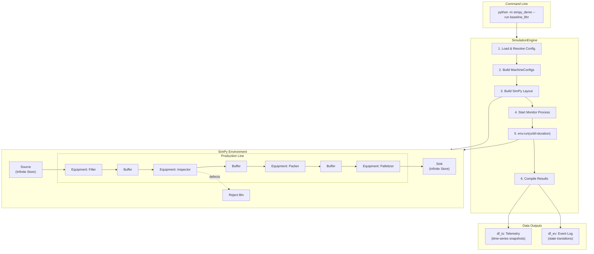
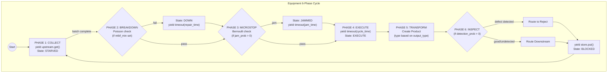
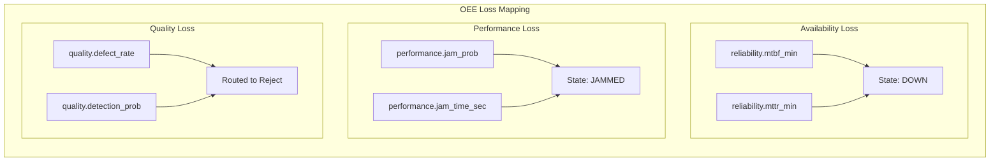

# Digital Twin Architecture

## Configuration Flow

```mermaid
flowchart TB
    subgraph ConfigFiles ["config/ Directory"]
        Run["runs/baseline_8hr.yaml"]
        Scenario["scenarios/baseline.yaml"]
        Topology["topologies/cosmetics_line.yaml"]
        Equipment["equipment/*.yaml"]
        Materials["materials/cosmetics.yaml"]
    end

    subgraph Loader ["ConfigLoader"]
        LoadRun["load_run()"]
        LoadScenario["load_scenario()"]
        LoadTopology["load_topology()"]
        LoadEquipment["load_equipment()"]
        Resolve["resolve_run()"]
        Build["build_machine_configs()"]
    end

    subgraph Resolved ["ResolvedConfig"]
        RC_Run["RunConfig"]
        RC_Scenario["ScenarioConfig"]
        RC_Topology["TopologyConfig"]
        RC_Equipment["EquipmentConfig[]"]
    end

    Run --> LoadRun --> RC_Run
    RC_Run -->|scenario: baseline| LoadScenario
    Scenario --> LoadScenario --> RC_Scenario
    RC_Scenario -->|topology: cosmetics_line| LoadTopology
    Topology --> LoadTopology --> RC_Topology
    RC_Scenario -->|equipment: [Filler, ...]| LoadEquipment
    Equipment --> LoadEquipment --> RC_Equipment

    Resolve --> Resolved
    Resolved --> Build --> MachineConfig["MachineConfig[]"]
    MachineConfig --> Engine["SimulationEngine"]
```

## High-Level Architecture



## Equipment 6-Phase Cycle



## OEE Loss Mapping



## Configuration Files

| Directory | Purpose | Example |
|-----------|---------|---------|
| `config/runs/` | Run parameters (duration, seed, start_time) | `baseline_8hr.yaml` |
| `config/scenarios/` | What-if experiments (topology + equipment refs) | `baseline.yaml` |
| `config/topologies/` | Line structure (station order, batch sizes) | `cosmetics_line.yaml` |
| `config/equipment/` | Equipment parameters (uph, reliability, etc.) | `filler.yaml` |
| `config/materials/` | Material type definitions | `cosmetics.yaml` |

## Timestamp Handling

Timestamps are embedded during simulation (not post-hoc):

```
datetime = start_time + timedelta(seconds=env.now)
```

- `start_time` is configured in RunConfig (ISO 8601 format)
- If not specified, defaults to `datetime.now()`
- Both telemetry and events include `datetime` column

## Resolution Flow

1. **Run** → specifies scenario name
2. **Scenario** → specifies topology + equipment list + overrides
3. **Topology** → defines station order and batch sizes
4. **Equipment** → provides default parameters per station
5. **Overrides** → scenario-specific parameter changes

## CLI Usage

```bash
# Run default config
python -m simpy_demo

# Run specific config
python -m simpy_demo --run baseline_8hr

# Export to CSV
python -m simpy_demo --run baseline_8hr --export

# Use custom config directory
python -m simpy_demo --config ./my_configs --run custom_scenario
```
