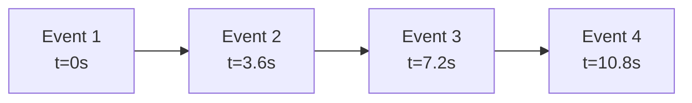
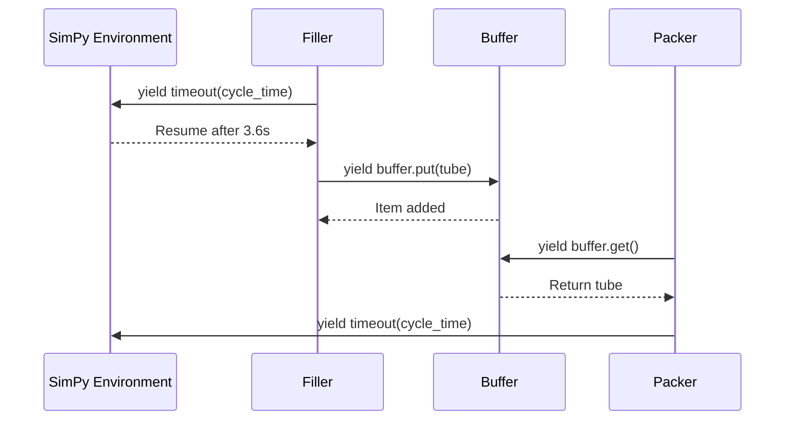
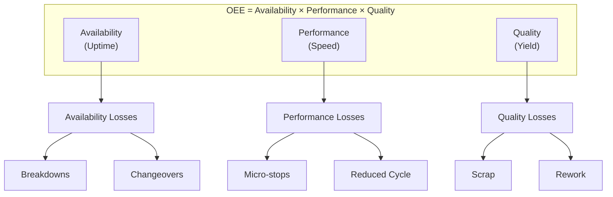
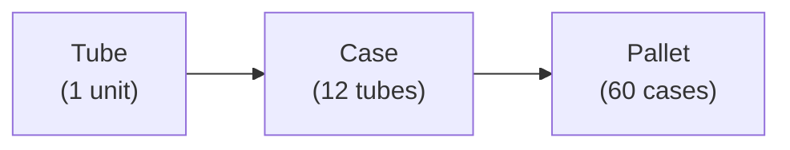
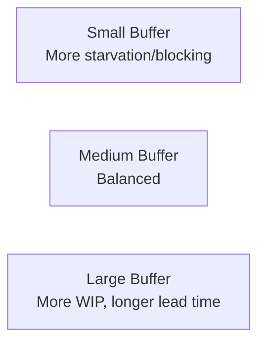
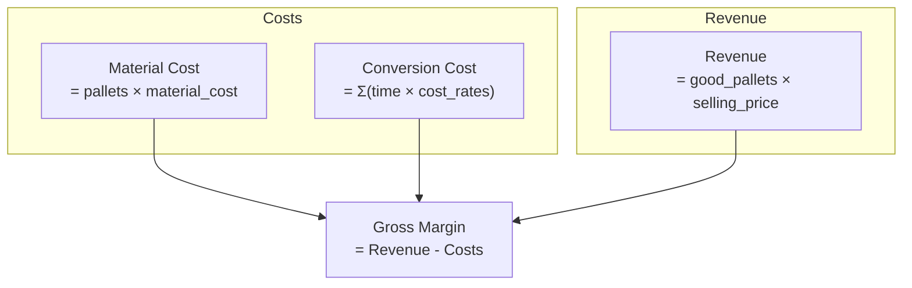

# Core Concepts

Understanding the fundamentals behind SimPy-Demo.

## Discrete Event Simulation (DES)

DES models systems as a sequence of events that change state at discrete points in time.

### How It Works



Unlike continuous simulation (which calculates state at every time step), DES jumps directly from event to event:

| Approach | Time Handling | Use Case |
|----------|---------------|----------|
| Continuous | Fixed time steps (dt=0.001s) | Physics, fluid dynamics |
| Discrete Event | Jump to next event | Manufacturing, queueing |

### Why DES for Manufacturing?

Production lines are naturally event-driven:

- Machine starts processing (event)
- Machine finishes processing (event)
- Machine breaks down (event)
- Buffer becomes full (event)

DES efficiently simulates hours of production by skipping idle time.

## SimPy Framework

SimPy is a Python library for DES using generator-based coroutines.

### Key Concepts

**Environment**: The simulation clock and event scheduler

```python
import simpy
env = simpy.Environment()
env.run(until=28800)  # Run for 8 hours (seconds)
```

**Process**: A generator function that yields events

```python
def machine(env):
    while True:
        yield env.timeout(3.6)  # Process for 3.6 seconds
        print(f"Produced item at {env.now}")
```

**Store**: A buffer for passing items between processes

```python
buffer = simpy.Store(env, capacity=100)
yield buffer.put(item)   # Add item to buffer
item = yield buffer.get() # Remove item from buffer
```

### Simulation Flow



## OEE (Overall Equipment Effectiveness)

OEE measures manufacturing productivity as a percentage.

### The OEE Formula

$$
\text{OEE} = \text{Availability} \times \text{Performance} \times \text{Quality}
$$

### Loss Categories



### How SimPy-Demo Models OEE

| OEE Component | Config Parameter | Simulation Behavior |
|---------------|------------------|---------------------|
| **Availability** | `reliability.mtbf_min` | Poisson-distributed breakdowns |
| | `reliability.mttr_min` | Uniform repair time |
| **Performance** | `performance.jam_prob` | Bernoulli per-cycle jam check |
| | `performance.jam_time_sec` | Fixed jam duration |
| **Quality** | `quality.defect_rate` | Probability of defective output |
| | `quality.detection_prob` | Probability of catching defects |

### Example OEE Calculation

From an 8-hour simulation:

| Component | Formula | Value |
|-----------|---------|-------|
| Availability | (Total - Downtime) / Total | (28800 - 2000) / 28800 = 93.1% |
| Performance | Actual / Theoretical output | 7500 / 8000 = 93.8% |
| Quality | Good / Total output | 372 / 384 = 96.9% |
| **OEE** | A × P × Q | 93.1% × 93.8% × 96.9% = **84.6%** |

## Production Line Modeling

### V-Curve Balance

In a balanced line, each station has the same cycle time (UPH = Units Per Hour):

```
Filler: 4000 tubes/hr → Inspector: 4000 tubes/hr → Packer: 4000 cases/hr × 12 = 4000 tubes/hr
```

### Material Transformation

Products transform as they flow through the line:



Each station has a `batch_in` parameter defining how many inputs it needs:

| Station | batch_in | output_type |
|---------|----------|-------------|
| Filler | 1 | Tube |
| Inspector | 1 | Tube |
| Packer | 12 | Case |
| Palletizer | 60 | Pallet |

### Buffer Dynamics

Buffers absorb variation between stations:

- **Starvation**: Upstream buffer empty → machine waits (STARVED state)
- **Blocking**: Downstream buffer full → machine waits (BLOCKED state)

Buffer sizing affects throughput:



## Economic Model

SimPy-Demo tracks costs and revenue per simulation.

### Cost Components



### Example Calculation

| Item | Formula | Value |
|------|---------|-------|
| Pallets produced | - | 384 |
| Good pallets | - | 372 |
| Material cost | 384 × $150 | $57,600 |
| Conversion cost | 8hr × $1,600/hr | $12,800 |
| Revenue | 372 × $450 | $167,400 |
| **Gross margin** | $167,400 - $57,600 - $12,800 | **$97,000 (58%)** |

## Next Steps

- **[Configuration](../user-guide/configuration.md)** - Learn the YAML config system
- **[Architecture](../architecture.md)** - See how components connect
- **[Glossary](../reference/glossary.md)** - CPG and DES terminology
