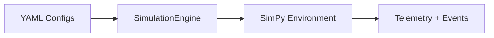

# SimPy-Demo Documentation

**Discrete Event Simulation for CPG Production Lines**

SimPy-Demo is a production line simulator for Consumer Packaged Goods (CPG) manufacturing. It models high-speed packaging lines with realistic equipment behavior, quality control, and economic tracking.

## What Can You Do?

<div class="grid cards" markdown>

- :material-rocket-launch: **Run Simulations**

    ---

    Model 8-hour shifts with configurable equipment, reliability parameters, and quality gates.

    [:octicons-arrow-right-24: Quickstart](getting-started/quickstart.md)

- :material-cog: **Configure Scenarios**

    ---

    Create what-if experiments by adjusting buffer sizes, equipment parameters, and line topology.

    [:octicons-arrow-right-24: Configuration](user-guide/configuration.md)

- :material-chart-line: **Analyze Results**

    ---

    Export time-series telemetry and event logs for OEE analysis, predictive maintenance, and process mining.

    [:octicons-arrow-right-24: Outputs](user-guide/outputs.md)

- :material-currency-usd: **Track Economics**

    ---

    Calculate material costs, conversion costs, revenue, and gross margin per SKU.

    [:octicons-arrow-right-24: Products & Economics](user-guide/products-economics.md)

</div>

## Quick Example

```bash
# Install
poetry install

# Run an 8-hour simulation
poetry run python -m simpy_demo --run baseline_8hr --export

# View results
ls output/
```

## Key Features

| Feature | Description |
|---------|-------------|
| **OEE Modeling** | Availability (breakdowns), Performance (jams), Quality (defects) |
| **Economic Tracking** | Material cost, conversion cost, revenue, gross margin |
| **YAML Configuration** | No code changes needed for what-if experiments |
| **Reproducible Runs** | Scenario bundles capture config snapshots |
| **Graph Topology** | Support for branching, merging, and conditional routing |
| **Pluggable Behavior** | 6-phase equipment cycle defined in YAML |

## Architecture Overview



## Getting Started

1. **[Installation](getting-started/installation.md)** - Set up Poetry and dependencies
2. **[Quickstart](getting-started/quickstart.md)** - Run your first simulation in 5 minutes
3. **[Concepts](getting-started/concepts.md)** - Understand DES, OEE, and SimPy basics

## Documentation Sections

- **[User Guide](user-guide/configuration.md)** - Configuration, running simulations, outputs
- **[Tutorials](tutorials/basic-simulation.md)** - Step-by-step walkthroughs
- **[Reference](reference/config-schema.md)** - API, config schema, CLI reference
- **[Architecture](architecture.md)** - System design with Mermaid diagrams
