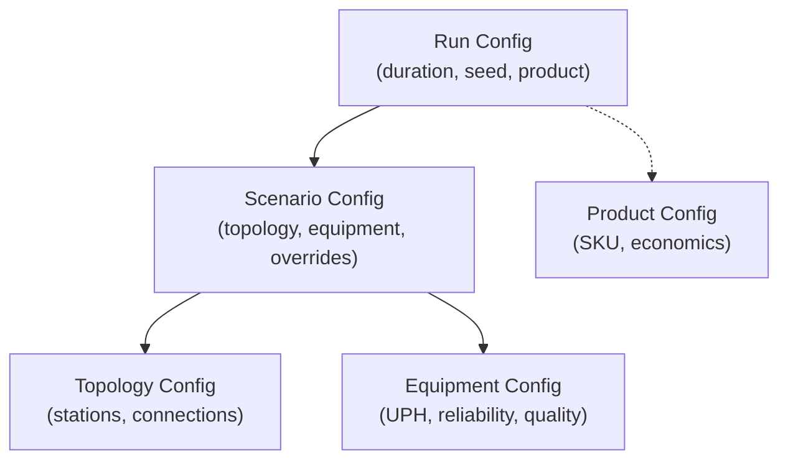
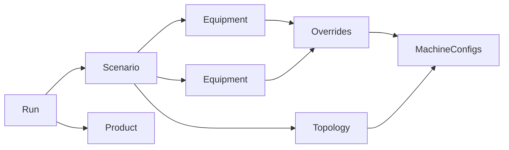

# Configuration

SimPy-Demo uses a layered YAML configuration system that separates concerns and enables what-if experiments without code changes.

## Configuration Hierarchy



## Directory Structure

```
config/
├── runs/              # Simulation run parameters
│   └── baseline_8hr.yaml
├── scenarios/         # What-if experiment definitions
│   └── baseline.yaml
├── topologies/        # Line structure
│   └── cosmetics_line.yaml
├── equipment/         # Equipment parameters
│   ├── filler.yaml
│   ├── inspector.yaml
│   ├── packer.yaml
│   └── palletizer.yaml
├── products/          # SKU definitions
│   └── fresh_toothpaste_5oz.yaml
├── behaviors/         # Phase behavior definitions
│   └── default_6phase.yaml
├── sources/           # Source store configuration
│   └── infinite_raw.yaml
├── defaults.yaml      # Global default values
└── constants.yaml     # Named constants
```

## Run Config

Run configs define simulation parameters.

**Location**: `config/runs/*.yaml`

```yaml
# config/runs/baseline_8hr.yaml
name: baseline_8hr
scenario: baseline           # Reference to scenario config
product: fresh_toothpaste_5oz  # Reference to product config (optional)
duration_hours: 8.0
random_seed: 42
telemetry_interval_sec: 300.0  # 5-minute intervals
start_time: "2025-01-06T06:00:00"  # ISO 8601 format
```

| Field | Type | Required | Default | Description |
|-------|------|----------|---------|-------------|
| `name` | string | Yes | - | Unique identifier |
| `scenario` | string | Yes | - | Reference to scenario |
| `product` | string | No | null | Reference to product (enables economics) |
| `duration_hours` | float | No | 8.0 | Simulation length |
| `random_seed` | int | No | 42 | RNG seed for reproducibility |
| `telemetry_interval_sec` | float | No | 300.0 | Data collection interval |
| `start_time` | string | No | now() | Simulation start timestamp |

## Scenario Config

Scenario configs define what equipment runs on which topology.

**Location**: `config/scenarios/*.yaml`

```yaml
# config/scenarios/baseline.yaml
name: baseline
topology: cosmetics_line      # Reference to topology config
equipment:                    # References to equipment configs
  - Filler
  - Inspector
  - Packer
  - Palletizer
overrides:                    # Per-equipment parameter overrides
  Filler:
    buffer_capacity: 200
  Packer:
    performance:
      jam_prob: 0.005
```

| Field | Type | Required | Description |
|-------|------|----------|-------------|
| `name` | string | Yes | Unique identifier |
| `topology` | string | Yes | Reference to topology |
| `equipment` | list | Yes | List of equipment references |
| `overrides` | dict | No | Per-equipment parameter overrides |
| `behavior` | string | No | Reference to behavior config |

### Using Overrides

Overrides let you modify equipment parameters without editing the base config:

```yaml
overrides:
  Filler:
    uph: 4500                    # Simple field override
    buffer_capacity: 300
    reliability:                 # Nested field override
      mtbf_min: 1800
      mtbf_max: 3600
```

## Topology Config

Topology configs define the production line structure.

**Location**: `config/topologies/*.yaml`

### Linear Format (Simple)

```yaml
# config/topologies/cosmetics_line.yaml
name: cosmetics_line
stations:
  - name: Filler
    batch_in: 1
    output_type: Tube
  - name: Inspector
    batch_in: 1
    output_type: Tube
  - name: Packer
    batch_in: 12
    output_type: Case
  - name: Palletizer
    batch_in: 60
    output_type: Pallet
```

### Graph Format (Advanced)

For branching, merging, and conditional routing:

```yaml
# config/topologies/cosmetics_line_graph.yaml
name: cosmetics_line_graph
nodes:
  - name: Filler
    equipment_ref: filler
    output_type: Tube
  - name: Inspector
    equipment_ref: inspector
    output_type: Tube
  - name: Packer
    equipment_ref: packer
    output_type: Case
  - name: Palletizer
    equipment_ref: palletizer
    output_type: Pallet
edges:
  - source: _source
    target: Filler
  - source: Filler
    target: Inspector
  - source: Inspector
    target: Packer
    condition: "not product.is_defective"
  - source: Inspector
    target: _reject
    condition: "product.is_defective"
  - source: Packer
    target: Palletizer
  - source: Palletizer
    target: _sink
```

## Equipment Config

Equipment configs define machine parameters.

**Location**: `config/equipment/*.yaml`

```yaml
# config/equipment/filler.yaml
name: Filler
uph: 4000                  # Units per hour
buffer_capacity: 200       # Output buffer size

reliability:               # Availability loss parameters
  mtbf_min: 3600          # Min time between failures (seconds)
  mtbf_max: 7200          # Max time between failures
  mttr_min: 120           # Min repair time (seconds)
  mttr_max: 300           # Max repair time

performance:               # Performance loss parameters
  jam_prob: 0.002         # Probability of jam per cycle
  jam_time_sec: 30        # Jam duration

quality:                   # Quality loss parameters
  defect_rate: 0.01       # Probability of defect
  detection_prob: 0.95    # Probability of detecting defect

cost_rates:                # Economic parameters
  labor_per_hour: 25.0
  energy_per_hour: 15.0
  overhead_per_hour: 10.0
```

See [Config Schema Reference](../reference/config-schema.md) for all fields.

## Product Config

Product configs define SKU attributes and economics.

**Location**: `config/products/*.yaml`

```yaml
# config/products/fresh_toothpaste_5oz.yaml
name: fresh_toothpaste_5oz
description: "Fresh Toothpaste 5oz Tube"
size_oz: 5.0
net_weight_g: 141.75
units_per_case: 12
cases_per_pallet: 60
material_cost: 150.00      # $ per pallet
selling_price: 450.00      # $ per pallet
```

## Resolution Flow

When you run a simulation, configs are resolved in order:

1. Load **Run** config
2. Load **Scenario** referenced by Run
3. Load **Topology** referenced by Scenario
4. Load **Equipment** configs referenced by Scenario
5. Apply **Overrides** from Scenario
6. Load **Product** if referenced by Run
7. Build `MachineConfig` objects for simulation



## Creating What-If Experiments

### Method 1: New Scenario with Overrides

Create a new scenario that references existing equipment but overrides specific parameters:

```yaml
# config/scenarios/high_buffer_test.yaml
name: high_buffer_test
topology: cosmetics_line
equipment:
  - Filler
  - Inspector
  - Packer
  - Palletizer
overrides:
  Filler:
    buffer_capacity: 500
  Packer:
    buffer_capacity: 500
```

```yaml
# config/runs/high_buffer_8hr.yaml
name: high_buffer_8hr
scenario: high_buffer_test
duration_hours: 8.0
```

### Method 2: New Equipment Config

Create a new equipment config for major changes:

```yaml
# config/equipment/filler_high_speed.yaml
name: FillerHighSpeed
uph: 6000
buffer_capacity: 300
# ... rest of config
```

Reference it in a scenario:

```yaml
# config/scenarios/high_speed_test.yaml
name: high_speed_test
topology: cosmetics_line
equipment:
  - FillerHighSpeed  # Use new equipment
  - Inspector
  - Packer
  - Palletizer
```

## Next Steps

- **[Running Simulations](running-simulations.md)** - Execute your configs
- **[Scenarios](scenarios.md)** - Deep dive into what-if experiments
- **[Config Schema](../reference/config-schema.md)** - All fields documented
