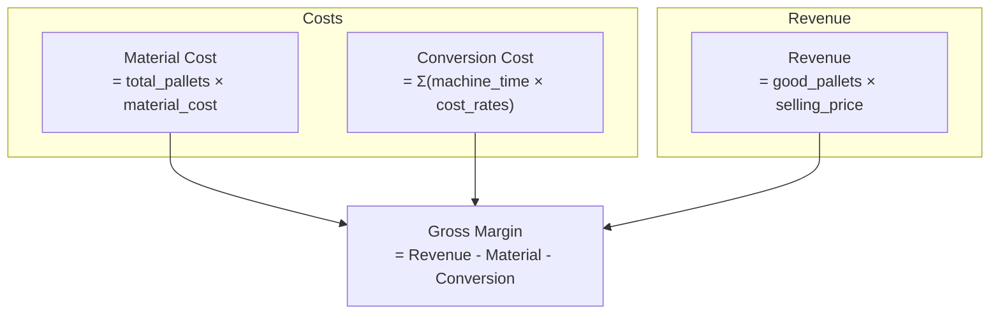

# Products & Economics

Virtual Twin tracks material costs, conversion costs, revenue, and gross margin when a product is configured.

## Product Configuration

Products define SKU attributes and economic parameters.

**Location**: `config/products/*.yaml`

```yaml
# config/products/fresh_toothpaste_5oz.yaml
name: fresh_toothpaste_5oz
description: "Fresh Toothpaste 5oz Tube"
size_oz: 5.0
net_weight_g: 141.75
units_per_case: 12
cases_per_pallet: 60
material_cost: 150.00      # $ per pallet
selling_price: 450.00      # $ per pallet
```

### Product Fields

| Field | Type | Description |
|-------|------|-------------|
| `name` | string | Unique identifier |
| `description` | string | Human-readable description |
| `size_oz` | float | Product size in ounces |
| `net_weight_g` | float | Net weight in grams |
| `units_per_case` | int | Number of units per case |
| `cases_per_pallet` | int | Number of cases per pallet |
| `material_cost` | float | Material cost per pallet ($) |
| `selling_price` | float | Selling price per pallet ($) |

## Enabling Economics

Reference a product in your run config:

```yaml
# config/runs/baseline_8hr.yaml
name: baseline_8hr
scenario: baseline
product: fresh_toothpaste_5oz  # This enables economics
duration_hours: 8.0
```

Without a product reference, economic tracking is disabled.

## Economic Model

### Cost Components



### Material Cost

Material cost is based on total pallets produced (including defective):

$$
\text{Material Cost} = \text{total\_pallets} \times \text{material\_cost}
$$

This reflects that materials are consumed regardless of quality outcome.

### Conversion Cost

Conversion cost is based on equipment operating time:

$$
\text{Conversion Cost} = \sum_{\text{machine}} \text{time\_in\_state} \times \text{cost\_rates}
$$

Where `cost_rates` include:

- `labor_per_hour` - Direct labor cost
- `energy_per_hour` - Energy consumption
- `overhead_per_hour` - Allocated overhead

### Equipment Cost Rates

Configure cost rates per equipment:

```yaml
# config/equipment/filler.yaml
name: Filler
uph: 4000
cost_rates:
  labor_per_hour: 25.0
  energy_per_hour: 15.0
  overhead_per_hour: 10.0
```

Total hourly cost: $25 + $15 + $10 = $50/hour

### Revenue

Revenue is based on good (non-defective) pallets only:

$$
\text{Revenue} = \text{good\_pallets} \times \text{selling\_price}
$$

### Gross Margin

$$
\text{Gross Margin} = \text{Revenue} - \text{Material Cost} - \text{Conversion Cost}
$$

$$
\text{Margin \%} = \frac{\text{Gross Margin}}{\text{Revenue}} \times 100
$$

## Example Calculation

For an 8-hour simulation:

| Metric | Formula | Value |
|--------|---------|-------|
| Total pallets | - | 384 |
| Good pallets | - | 372 |
| Defective pallets | - | 12 |
| Material cost | 384 × $150 | $57,600 |
| Conversion cost | 8hr × $1,600/hr | $12,800 |
| Revenue | 372 × $450 | $167,400 |
| Gross margin | $167,400 - $57,600 - $12,800 | **$97,000** |
| Margin % | $97,000 / $167,400 | **57.9%** |

## Telemetry Output

Economic data appears in telemetry at each interval:

| Column | Description |
|--------|-------------|
| `sku_name` | Product name |
| `sku_description` | Product description |
| `size_oz` | Product size |
| `units_per_case` | Units per case |
| `cases_per_pallet` | Cases per pallet |
| `material_cost` | Material cost this interval |
| `conversion_cost` | Conversion cost this interval |
| `revenue` | Revenue this interval |
| `gross_margin` | Gross margin this interval |

!!! note "Incremental Values"
    Economic values in telemetry are **incremental** (per interval), not cumulative. Sum them to get totals.

## Creating Multiple Products

Define different SKUs for different scenarios:

```yaml
# config/products/premium_toothpaste_8oz.yaml
name: premium_toothpaste_8oz
description: "Premium Whitening Toothpaste 8oz"
size_oz: 8.0
net_weight_g: 226.8
units_per_case: 12
cases_per_pallet: 48
material_cost: 200.00
selling_price: 600.00
```

```yaml
# config/products/economy_toothpaste_3oz.yaml
name: economy_toothpaste_3oz
description: "Economy Toothpaste 3oz"
size_oz: 3.0
net_weight_g: 85.05
units_per_case: 24
cases_per_pallet: 72
material_cost: 100.00
selling_price: 280.00
```

## Comparing Product Economics

Run the same scenario with different products:

```yaml
# config/runs/premium_8hr.yaml
name: premium_8hr
scenario: baseline
product: premium_toothpaste_8oz
duration_hours: 8.0

# config/runs/economy_8hr.yaml
name: economy_8hr
scenario: baseline
product: economy_toothpaste_3oz
duration_hours: 8.0
```

```bash
poetry run python -m virtual_twin --run premium_8hr --export
poetry run python -m virtual_twin --run economy_8hr --export
```

Compare profitability:

```python
import pandas as pd

premium = pd.read_csv("output/telemetry_premium_8hr_*.csv")
economy = pd.read_csv("output/telemetry_economy_8hr_*.csv")

print(f"Premium margin: ${premium['gross_margin'].sum():,.0f}")
print(f"Economy margin: ${economy['gross_margin'].sum():,.0f}")
```

## Economic Impact of OEE

OEE directly affects economics:

| OEE Impact | Economic Effect |
|------------|-----------------|
| Availability loss (breakdowns) | Conversion cost continues, no revenue |
| Performance loss (jams) | Conversion cost continues, reduced output |
| Quality loss (defects) | Material cost incurred, no revenue |

### Example: Quality Improvement ROI

Compare baseline vs. improved quality:

```yaml
# config/scenarios/high_quality.yaml
name: high_quality
topology: cosmetics_line
equipment:
  - Filler
  - Inspector
  - Packer
  - Palletizer
overrides:
  Filler:
    quality:
      defect_rate: 0.005  # Halve defects
```

| Scenario | Defect Rate | Good Pallets | Revenue | Margin |
|----------|-------------|--------------|---------|--------|
| Baseline | 3% | 372 | $167,400 | $97,000 |
| High Quality | 1.5% | 378 | $170,100 | $99,700 |
| **Improvement** | | +6 | +$2,700 | +$2,700 |

## Next Steps

- **[Outputs](outputs.md)** - Understand output data format
- **[OEE Analysis Tutorial](../tutorials/oee-analysis.md)** - Calculate OEE from events
- **[Config Schema](../reference/config-schema.md)** - All product fields
